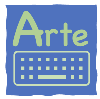
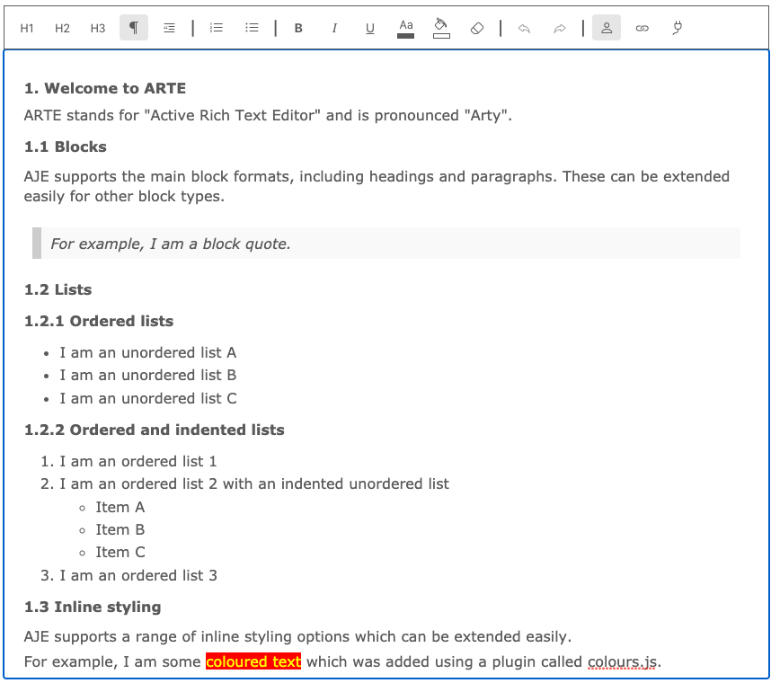
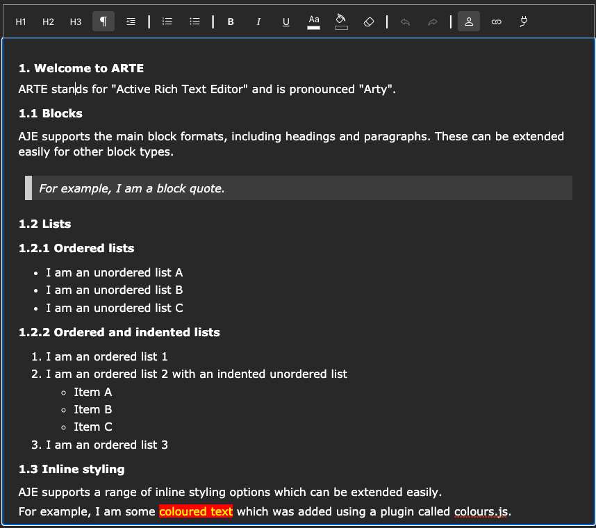

# README.md



## Introduction

ARTE (pronounced *Arty*) stands for *Active Rich Text Editor*. Does the world need another WYSIWYG Rich Text Editor? Possibily not, but in the course of developing my own applications I became frustrated with those I could find online. First of all I wanted something written in vanilla Javascript that could be embedded easily in any website independent of framework.

Secondly, and where I struggled most, it should be easy to extend - including the ability to embed "active" content that can be edited using its own dialogue.

Thirdly, the whole editor needs to be modular, written using plugins so that there is a single implementation pattern. For example, all the standard toolbar buttons are written as block, list, and inline styling plugins.

Fourthly, it cannot use the builtin browser support for contenteditable `execCommand`, since this throws up too many inconsistencies between browsers. Therefore, all dom operations are implemented at a low level, such that where possible, behaviour is consistent across modern browsers.

Lastly, it needs to be open source and free so that there are no commercial drawbacks or lockins to proprietary code that could be difficult to fix. ARTE is written in ES6 but can be built using Webpack and Babel (or your favourite build tool) potentially opening up usage on a wide range of browsers. For my purposes I have initially targetted Chrome and Safari. The following screenshot shows what the editor looks like using its light theme:



*Disclaimer*

ARTE has not been tested extensively across an extensive range of browsers and in particular touch interfaces have only been tested briefly on mobile Safari on an iPhone. 

## Usage

To use in development (source) mode, download or clone the repository.

The root `index.html` file has the following lines in order to pull in the bootstrap icons that we use by default and a simple style sheet:

```
    <link rel="stylesheet" href="https://cdn.jsdelivr.net/npm/bootstrap-icons@1.5.0/font/bootstrap-icons.css">
    <link rel="stylesheet" href="./public/css/styles.css">
```

Further down you should see a placeholder div in the body:

```
<div id="editor"></div>
```

There is also a button to demonstrate how to save the content of the editor:

```
<button type="button" id="save">Save</button>
```

Next we have the javascript:

```
<script type="module" charset="utf-8">
    import * as ARTE from './src/js/ARTE-bundle-ES6.JS'
    const target = document.getElementById('editor')
    // Set the initial content to the current content of the editor div
    let content = target.innerHTML
    // Clear any existing content
    target.innerHTML = ''
    // Setup toolbar
    const toolbar = [
        [ ARTE.Blocks.H1, ARTE.Blocks.H2, ARTE.Blocks.H3, ARTE.Blocks.P, ARTE.Blocks.BQ],
        [ ARTE.Blocks.OL, ARTE.Blocks.UL],
        [ ARTE.Styles.B, ARTE.Styles.I, ARTE.Styles.U, ARTE.Colours.FOREGROUND, ARTE.Colours.BACKGROUND, ARTE.Styles.CLEAR],
        [ ARTE.Buffer.UNDO, ARTE.Buffer.REDO ],
        [ ARTE.Mentions.BUTTON, ARTE.Links.BUTTON, ARTE.Custom.BUTTON ]
    ]
    // Setup plugins
    ARTE.Mentions.setup(['David','William', 'Jenny','Sally', 'Sarah', 'Susan','Brian'])
    // Define editor options
    const options = {
        // Automatically number headings using outline numbering. Allowed values 'on', 'off'       
        headingNumbers: 'on', 
        // Number of Undo operations supported, max 10       
        bufferSize: 10     
    }
    // Create editor and add to dom in target position
    const editor = new ARTE.Editor(target, content, toolbar, options)
    // Configure save button
    const save = document.getElementById('save')
    save.addEventListener('click', ()=>{
        const xml = editor.save()
        console.warn('Cleaned editor content:\n'+xml)
        window.alert('Cleaned editor content:\n'+xml)
    })
</script>
```


## Building production and development versions

### Prequisites

You'll need the latest versions of node and npm installed, as well as webpack, the webpack copy plugin and Babel.

```
$ npm install --save-dev webpack
$ npm install --save-dev webpack-cli
$ npm install copy-webpack-plugin --save-dev
$ npm install @babel/core @babel/preset-env babel-loader
```

### Run a build script

Referring to `package.json`, run one of the NPM scripts to create your target version:

```
  "scripts": {
    "build-test": "webpack --env=mode=development --env=target=ES6 --config webpack.config.js",
    "build-es6": "webpack --env mode=production --env target=ES6 --config webpack.config.js",
    "build-es5": "webpack --env mode=production --env target=ES5 --config webpack.config.js",
    "build-all": "webpack --env mode=production --env target=ES6 --config webpack.config.js && webpack --env mode=production --env target=ES5 --config webpack.config.js"

  },
```

e.g. run the command to create a minimised single ES5 compatible file `ARTE-bundle-ES5.js` in the `public/js` folder:

```
$ npm run build-es5
```

As well as creating the target bundle, these commands also copy required static files to the public folder.

Now you can serve the `public/index.html` which has the following script declarations in place of those of the development `index.html` file:

```
<script src="./js/ARTE-bundle-ES6.js" charset="utf-8"></script>
<script type="text/javascript"> 
```

## Customising the appearance

ARTE provides three style sheets in `src/css`:

```
styles.css
dark-theme.css
light-theme.css
``` 

To switch between light and dark themes simply swap the import statement at the top of `styles.css` in order to change the appearance to the following:



Additional themes can be added easily by adding further theme files with their own variable settings.

The icons used in our example code come from Bootstrap but these may be replaced with a different set by importing a different set and updating the file:

```
src/js/icons.js
```

## Writing your own plugins

Plugins reside in the `src/plugins/` folder and are written as ES6 modules. Each plugin exports one or more button objects, each with a set of mandatory and optional attributes. Additionally, a plugin may have additional module wide methods that require custom implementation. For example, referring to the html example earlier you will see a line:

```
ARTE.Mentions.setup(['David','William', 'Jenny','Sally', 'Sarah', 'Susan','Brian'])
```

which demonstrate specific setup that cannot be abstracted with a common interface. In theory a plugin could have as many of these custom methods as you like but in practice it would be better to minimise the number and ideally follow the pattern here with a single setup function, which can of course take any required parameters specific to the plugin.

Referring to `src/plugins/blocks.js` we see a number of buttons declared, including the following:

```
const options = {setState}
export const H1 = new ToolbarButton( 'block', 'H1', 'Heading 1', Icons.h1, click, options )
```

Here the button `H1` is created as an instance of the `ToolbarButton` class and takes the following parameters (refer to `src/ToolbarButton.js`):

| Parameter | Type | Description |
|-----------|------|-------------|
| `type` | string | Allowed values: 'block','list','style','buffer','custom' |
| `tag` | string | The tag as inserted in the dom. e.g. H1, P, CUSTOM |
| `label` | string | Generally used as the title of the button but could also be displayed |
| `icon` | string | The icon to use for the button |
| `click` | function | The callback invoked when the button is clicked |
| `options` | object | Optional methods and data. |

Plugins come in two flavours:

1. Passive 
2. Active (hence the name ARTE)

Passive plugins perform some operation on the editor, updating the content and then exit. Active plugins perform the same actions but expose the ability to edit the inserted content, such as with a visible `edit` button or simply by supporting a _click_, _double-click_ or _right-click_ interaction, the choice being yours.

`Block` and `list` elements relate to normal HTML block tags, such as headings, paragraphs and ordered lists. Inline `style` elements are implemented (for consistency) with styled `span` elements that may contain one or more `style:value` pairs in their `style` attribute.

The `buffer` type can be ignored as this is a special type reserved for handling undo/redo operations.

The `custom` type of plugin is used to insert and manage your own content. For examples of these with different edit interactions refer to:

```
src/plugins/links.js
src/plugins/custom.js
```

The former inserts links which can then be clicked to edit, delete or navigate to the link in a new tab. The latter inserts a custom set of properties with an associated edit button which can be clicked to edit or delete.

The full set of optional button methods is as follows:

| Attribute | Usage |
|-----------|-------|
| init   | `method`. Perform initial format of custom components in the editor, such as converting a compact data representation to a human readable format, and also to add event handlers for active plugins. |
| setState | `method`. Set the disabled and active states of a button. All buttons should be disabled if no range is selected in the editor, apart from the two buffer buttons, which depend on the state of the editor buffer. The active state is implemented by adding the `active` class to a button element in the toolbar, in order to match the current selection. So for example, selecting `bold` text should make the `bold` button active.
| style | `string`. For inline styles only, the style is represented as a string in one of two formats: such as `style:value` pairs in the `src/plugins/styles.js` plugin or style only, such as `color` in the `src/plugins/colours.js` plugin. Note that the `styles.js` plugin also exports its `click` method so that other plugins can take advantage of its styling capabaility. `colours.js` is a good example of the way this works, since the style value is not known until run time when it is chosen by the user via a dialogue. |
| removeStyle | `string`. For inline styles only, complements the `style` attribute and provide the definition for the styling to remove the applied styling already set. So for example in the `colours` plugin the remove style would apply the default font colour. |
| addEventHandlers | `method`. This method should reapply any required events handlers after any operations updating the editor dom tree. |
| clean | `method`. This method will be invoked when the editor `save` method is invoked in order to clean any custom plugin content. For example, a `clean` method could minimise a custom component by removing any decorations applied in the `init` method. |
| shortcut | `array`. A two-key sequence to trigger the button click event, such as [`@`,`Tab`] where `@` is the shortcut key and `Tab` is the trigger key. |

### Update ARTE.js

The source file `src/js/ARTE.js` defines which modules are available to your application:

```
import Editor from './Editor.js'
import Modal from './Modal.js'
import * as Buffer from './plugins/buffer.js'
import * as Blocks from './plugins/blocks.js'
import * as Styles from './plugins/styles.js'
import * as Mentions from './plugins/mentions.js'
import * as Links from './plugins/links.js'
import * as Colours from './plugins/colours.js'
import * as Custom from './plugins/custom.js'

export {
    Editor,
    Modal,
    Buffer,
    Blocks,
    Styles,
    Mentions,
    Links,
    Colours,
    Custom
}
```

Update this file as required, particularly before running a build script.

## Built-in modal support

ARTE comes with a Modals.js class module which supports three types of modal as well as several other configuration options which can be used when developing your own plugins:

| Option | Descrption and usage |
|--------|----------------------|
| type | `string`. One of `overlay`, `positioned`, `drawer`, `full-screen`. `overlay` modals are displayed in the centre of the page. `positioned` modals are displayed with their top-left corner near where you clicked your mouse and is used for our `mentions` plugin. `drawer` modals are slide-down drawers, typically used for creating and editing your own content. `full-screen` modals are like `drawer` except take up the whole screen. The default if not specified is `overlay`.|
| title | `string`. The text to appear in the header of the modal. If blank or not specified no title is displayed. |
| html | `string`. The html to display in the body of the modal. It would be unusual for this to be empty but it would be possible to display without. |
| severity | `string`. One of `info`, `warning` or `danger`. Setting this controls whether an icon is displayed (in an appropriate colour) in the modal header. If not set no icon is displayed. |
| escape | `boolean`. If true the modal can be dismissed by hitting the `Escape` key. The default is false if not specified. |
| buttons | `object`. A set of upto three buttons with optional callbacks. See example below. |
| borderRadius | `string`, e.g. `10px`. The default is none. |
| backgroundColour | `string`. Any allowed css colour specification. The default depends on which theme you selected |

### Example button specification
```
buttons: {
    cancel : { label:'Cancel' }, 
    delete : { label:'Delete', callback:()=>alert('delete')},
    confirm : {label:'Confirm', callback:()=>alert('confirm')}
}
```

## Acknowledgements

ARTE uses a small number of SVG icons sourced from the Bootstrap Icon library here:

https://icons.getbootstrap.com

### Licence

It is licenced under [MIT](https://opensource.org/licenses/mit-license.php).


